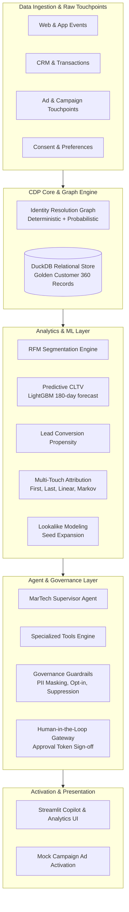

# Agentic Customer Data Platform (CDP) for Marketing Intelligence, Audience Activation, and Campaign Optimization

A production-style reference implementation of an **Agentic Customer Intelligence & Activation Platform** inspired by enterprise CDPs (such as Treasure Data / Treasure AI). 

The platform bridges enterprise data unification, machine learning analytics, identity graph resolution, multi-touch attribution, and a **governed conversational copilot with human-in-the-loop campaign activation**.

---

## 🏛️ Architecture Overview



---

## 🚀 Key Modules & Capabilities

1. **Identity Resolution & Customer 360**:
   - Resolves identities across fragmented touchpoints (`email`, `phone`, `crm_id`, `cookie_id`, `device_id`) into a unified `Unified Customer ID (UCID)`.
   - Graph-based clustering with confidence thresholding via `NetworkX`.

2. **Core Analytics & ML Engines**:
   - **RFM Segmentation**: Quantile-based classification (*Champions, Loyal, At-Risk High Value, Hibernating, etc.*).
   - **Predictive CLTV**: LightGBM regressor predicting forward 180-day customer revenue with evaluation metrics (MAE, RMSE, top-decile concentration).
   - **Lead Scoring**: Conversion propensity classifier with decile lift analysis.
   - **Multi-Touch Attribution (MTA)**: First-touch, last-touch, linear, time-decay, and Markov chain removal effect attribution.
   - **Lookalike Engine**: High-CLTV seed selection and propensity matching with automatic seed suppression.

3. **Agentic Copilot with Governance**:
   - Natural language interpreter translating marketer intent to structured CDP tool executions.
   - **PII Masking**: Automatic redaction of sensitive identifiers in agent inputs/outputs.
   - **Consent Verification**: Automatic filtering of non-consenting users (`do_not_track`, opt-out).
   - **Human-in-the-Loop Gateway**: Generates cryptographically secure approval tokens; prevents unapproved autonomous campaign activation.

4. **Interactive Dashboard**:
   - Built with **Streamlit** & **Plotly** to inspect 360 profiles, compare attribution models, view RFM distributions, and chat directly with the Copilot.

---

## 🛠️ Quickstart

### Prerequisites
- Python 3.12+
- `uv` package manager (or pip)

### Installation
```bash
# Clone the repository
cd tresure-data

# Install dependencies with uv
uv sync
```

### Run the Data Ingestion & ML Pipeline
```bash
PYTHONPATH=. uv run python src/cdp/pipeline.py
```

### Run Agent Benchmark & Safety Tests
```bash
PYTHONPATH=. uv run pytest tests/test_agent_evaluation.py -v
```

### Launch the Streamlit Copilot UI
```bash
PYTHONPATH=. uv run streamlit run src/app/streamlit_app.py
```
