# Agentic Customer Data Platform (CDP) for Marketing Intelligence, Audience Activation, and Campaign Optimization

A production-style **reference implementation** of an **Agentic Customer Intelligence & Activation Platform** — an end-to-end CDP-inspired system built from scratch: data unification, marketing analytics, LLM agents, and governed campaign activation.

The platform unifies fragmented customer data into golden 360 profiles, runs marketing ML analytics (RFM, predictive CLTV, lead propensity, multi-touch attribution, lookalikes), and exposes them through a **governed conversational copilot with real LLM tool calling and human-in-the-loop campaign activation**.

> ⚠️ This is a CDP-*inspired* reference implementation using **synthetic data**. It is not a claim to have built a production enterprise CDP.

---

## 🏛️ Architecture

```mermaid
flowchart TD
    subgraph Ingestion ["Data Ingestion & Raw Touchpoints"]
        A1[Web & App Events]
        A2[CRM & Transactions]
        A3[Ad & Campaign Touchpoints]
        A4[Consent & Preferences]
    end

    subgraph CDP ["CDP Core & Graph Engine"]
        B1[Identity Resolution Graph\nDeterministic + Probabilistic]
        B2[(DuckDB Relational Store\nGolden Customer 360 Records)]
    end

    subgraph Analytics ["Analytics & ML Layer"]
        C1[RFM Segmentation Engine]
        C2[Predictive CLTV\nLightGBM 180-day forecast]
        C3[Lead Conversion Propensity\n30-day forward label]
        C4[Multi-Touch Attribution\nFirst, Last, Linear, Decay, Markov]
        C5[Lookalike Modeling\nSeed Expansion]
    end

    subgraph Agent ["Agent & Governance Layer"]
        D1[Pydantic-AI Supervisor Agent\nLLM tool calling]
        D2[Typed CDP Tool Set\n8 governed tools]
        D3[Governance Guardrails\nPII Masking, Consent, Suppression]
        D4[Human-in-the-Loop Gateway\nSigned single-use approval tokens]
        D5[Agent Audit Log\nEvery action recorded]
    end

    subgraph Activation ["Activation & Presentation"]
        E1[Streamlit Copilot & Analytics UI]
        E2[Mock Campaign Activation]
        E3[Incrementality Measurement\nHoldout lift]
    end

    Ingestion --> CDP
    CDP --> Analytics
    Analytics --> Agent
    Agent --> Activation
```



---

## 🚀 Key Modules

### 1. Identity Resolution & Customer 360
- Resolves fragmented identifiers (`email`, `phone`, `crm_id`, `cookie_id`, `device_id`) into unified customer IDs (UCID) using **NetworkX graph clustering** with confidence thresholding.
- 11+ relational tables in DuckDB: profiles, identity map, transaction/event facts, touchpoints, consent, features, audiences, activations, audit log, tokens, experiments.

### 2. Analytics & ML Engines
| Module | Approach | Verified result (synthetic data) |
|---|---|---|
| **RFM** | Quantile-based segments (Champions → Hibernating) | 1,200 profiles, 9 segments |
| **Predictive CLTV** | LightGBM, observation/performance split, 180-day forward revenue | MAE $135, R² 0.59, top-decile holds 48.7% of revenue |
| **Lead scoring** | LightGBM, **forward-looking 30-day purchase label**, observation/label split | ROC-AUC 0.919, **4.05x top-decile lift** |
| **Multi-touch attribution** | First, last, linear, time-decay, and Markov removal-effect | Credit reconciles to total converted revenue |
| **Lookalikes** | Seed-segment expansion with consent/existing-customer suppression | Similarity + predicted CLTV ranking |

**Why the lead-scoring label matters:** an earlier version predicted “has this customer *ever* purchased” — a ~97% positive constant that produced a meaningless PR-AUC of 0.986. The label is now a truly forward-looking *purchase within the next 30 days* (14% base rate), so the metrics are honest and interpretable.

### 3. Agentic Copilot (multi-agent, real tool calling)
- **Supervisor / specialist orchestration with Pydantic-AI**: a supervisor agent decides which specialist to delegate to, and in what order, via typed async tools.
- **Six specialists**, each owning a subset of the CDP tools and returning a typed result:
  - **Audience Analyst** — builds consent-compliant audiences (`create_audience_filter`)
  - **Customer Analytics** — RFM overviews, 360 profiles
  - **Attribution Analyst** — MTA comparison (first/last/linear/decay/Markov)
  - **Lookalike** — seed-segment expansion into ranked prospects
  - **Campaign Planner** — drafts campaigns and issues signed approval tokens (never activates)
  - **Governance & Approval** — reviews activation requests against policy
- **Shared session state** (`SessionState` in `AgentDeps`): a value produced by one agent (e.g. `audience_id`) is visible to the next, enabling multi-step chains like *build audience → plan campaign for that audience → measure*.
- **Governed activation endpoint**: the supervisor's only direct tool, requiring a valid signed human token — the model cannot synthesise one.
- **Structured output** (`AgentAnswer`) with summary, key metrics, next action, governance notes.
- **Deterministic fallback** (`DeterministicRouter`) when no API key is set; it also threads session state so offline demos stay chained.
- **Thread-safe warehouse**: DuckDB connections are per-thread, because agent tools execute inside worker threads.

### 4. Governance & Human-in-the-Loop
- **Signed approval tokens**: HMAC-SHA256, expiring, bound to campaign/audience/channel scope, registered and **single-use** (replay rejected). A bare `MKT_APPRV_` prefix is no longer accepted.
- **Consent fail-closed**: `do_not_track`, missing consent, or `marketing_opt_in=False` are suppressed; audiences below a k-anonymity floor are rejected.
- **PII masking** on all output; explicit PII-export requests are blocked and logged.
- **Audit log**: every tool call, governance decision, and activation is recorded with its outcome.
- **SQL safety**: all queries parameterized.

---

## 🛠️ Quickstart

### Prerequisites
- Python 3.12+
- [`uv`](https://docs.astral.sh/uv/) (or pip)

### Install & configure
```bash
uv sync
cp .env.example .env   # then set CDP_APPROVAL_SECRET and optionally GROQ_API_KEY
```

| Variable | Required | Purpose |
|---|---|---|
| `CDP_APPROVAL_SECRET` | Yes (prod) | Signs approval tokens; generate with `python -c "import secrets; print(secrets.token_urlsafe(32))"` |
| `GROQ_API_KEY` | No | Enables real LLM tool calling; without it the agent uses deterministic fallback |
| `GROQ_MODEL` | No | Default `llama-3.3-70b-versatile` |

### Run the pipeline
```bash
PYTHONPATH=. uv run python src/cdp/pipeline.py
```

### Run the test suite (25 tests)
```bash
PYTHONPATH=. uv run pytest tests/ -v
```

### Launch the Streamlit Copilot UI
```bash
PYTHONPATH=. uv run streamlit run src/app/streamlit_app.py
```

---

## 🧭 Usage examples

```text
"Identify high-value at-risk customers for win-back"
  -> compliant audience (consent-filtered) with size and governance note

"Generate a lookalike audience of our Champions"
  -> ranked prospects with similarity score and predicted CLTV

"Compare attribution models across our channels"
  -> first/last/linear/decay/Markov channel credits + reconciliation

"Plan a re-engagement campaign"           -> draft plan + signed approval token
"Activate campaign with authorization MKT_APPRV_<token>" -> requires valid human sign-off
```

---

## 🎯 Capability Map

| Enterprise CDP capability | This project |
|---|---|
| Unified customer profiles + identity resolution | ✅ DuckDB profiles + graph identity resolution |
| Multi-touch attribution | ✅ 5 attribution models, reconciliation |
| Churn-risk / consent suppression | ✅ consent fail-closed + suppression |
| Conversational copilot | ✅ Streamlit chat + multi-agent supervisor |
| Specialist agent hub | ✅ 6 specialists: audience, analytics, attribution, lookalike, planner, governance |
| Human-in-the-loop activation | ✅ signed, scoped, single-use approval tokens |
| Agent auditability | ✅ full audit log |
| Incrementality / experimentation | ✅ holdout-based lift measurement |

*Not implemented (honest gaps): real-time/batch streaming, journey orchestration (CEP), complete/composable hybrid deployment, and commercial-grade consent management.*

---

## 📁 Project layout

```
src/
  ingestion/     synthetic data generator (entities, identities, events, touchpoints)
  cdp/           DuckDB warehouse (thread-safe), identity resolution graph, ETL pipeline
  analytics/     RFM, CLTV, lead scoring, MTA, lookalikes
  agents/        supervisor + specialists (6), session state, governance (PII, consent, tokens)
  app/           Streamlit copilot & dashboard
tests/           25 agent-orchestration, security & integrity tests
```